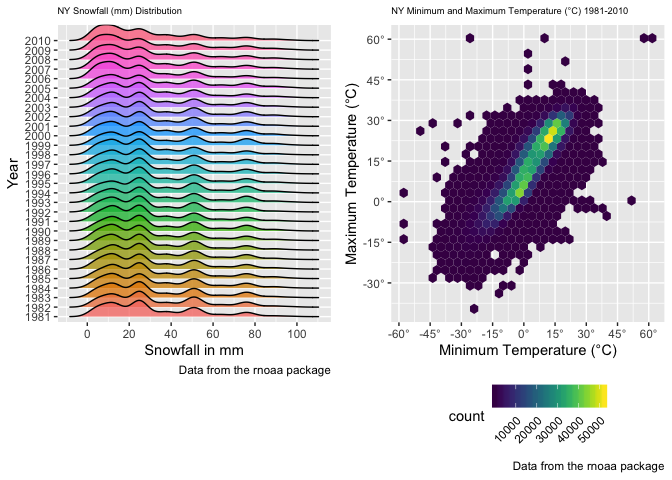

HW3
================
Eric Morris
10/5/2018

Problem 1
---------

Loading in the BRFSS Data:

``` r
library(p8105.datasets)

brfss_data = brfss_smart2010 %>% 
  janitor::clean_names() %>% 
  filter(topic == "Overall Health") %>% 
  select(-class, -topic, -question, -sample_size, -(confidence_limit_low:geo_location)) %>% 
  mutate(response = forcats::fct_relevel(response, c("Excellent", "Very good", "Good", "Fair", "Poor"))) %>% 
  rename(state = locationabbr, county = locationdesc)
```

``` r
brfss_data %>% 
  filter(year == 2002) %>% 
  group_by(state) %>% 
  distinct(county) %>% 
  summarize(n_state = n()) %>% 
  filter(n_state == 7) %>% 
  knitr::kable()
```

| state |  n\_state|
|:------|---------:|
| CT    |         7|
| FL    |         7|
| NC    |         7|

Connecticut, Florida and North Carolina were observed at 7 locations in 2002.

The “spaghetti plot” below shows the number of observations in each state from 2002 to 2010:

``` r
brfss_data %>% 
  distinct(state, county, year) %>% 
  group_by(state, year) %>% 
  summarize(n_locations = n()) %>% 
  ggplot(aes(x = year, y = n_locations, color = state)) + 
  geom_line() +
  labs(title = "Number of Observations in Each State 2002-2010",
       x = "Year",
       y = "Number of Observations by Location",
       caption = "Data from the BRFSS SMART dataset 2002-2010") +
  theme(axis.text.x = element_text(angle = 45, hjust = 1, size = 6),
        plot.title = element_text(hjust = 0.5, size = 10))
```


The table below shows, for the years 2002, 2006, and 2010, the mean and standard deviation of the proportion of “Excellent” responses across locations in NY State:

``` r
brfss_data %>% 
  filter(year == 2002 | year == 2006 | year == 2010, state =="NY") %>% 
  spread(key = response, value = data_value) %>% 
  janitor::clean_names() %>% 
  group_by(state, year) %>% 
  summarize(mean_excellent = mean(excellent, na.rm = TRUE),
            sd_excellent = sd(excellent, na.rm = TRUE)) %>% 
  knitr::kable()
```

| state |  year|  mean\_excellent|  sd\_excellent|
|:------|-----:|----------------:|--------------:|
| NY    |  2002|         24.04000|       4.486424|
| NY    |  2006|         22.53333|       4.000833|
| NY    |  2010|         22.70000|       3.567212|

The five-panel plot below shows, for each year and state, the state-level average proportion in each response category over time by category:

``` r
brfss_data %>% 
  spread(key = response, value = data_value) %>% 
  janitor::clean_names() %>% 
  group_by(state, year) %>% 
  summarize(mean_excellent = mean(excellent, na.rm = TRUE),
            mean_verygood = mean(very_good, na.rm = TRUE),
            mean_good = mean(good, na.rm = TRUE),
            mean_fair = mean(fair, na.rm = TRUE),
            mean_poor = mean(poor, na.rm = TRUE)) %>% 
  gather(key = mean_variable, value = mean_value, mean_excellent:mean_poor) %>% 
  ggplot(aes(x = year, y = mean_value, color = state)) +
  geom_line() +
  facet_grid(~mean_variable) + 
  labs(title = "Average Proportion in Each Response Category",
       x = "Year",
       y = "Average Proportion",
       caption = "Data from the BRFSS SMART dataset 2002-2010") +
  theme(axis.text.x = element_text(angle = 45, hjust = 1, size = 6),
        plot.title = element_text(hjust = 0.5, size = 10))
```


Problem 2
---------

Instacart Data Import

``` r
instacart_data = instacart %>% 
  janitor::clean_names()
  
unique_users = instacart_data %>% 
  distinct(user_id) %>% 
  nrow()

distinct_dept = instacart_data %>% 
  distinct(department) %>% 
  nrow()

distinct_products = instacart_data %>% 
  distinct(product_id) %>% 
  nrow()
```

In the instacart dataset there are 15 variables which include identifiers for aisle, order, product and customer along with a corresponding numerical ID in some cases (aisle and product for example). The instacart dataset also includes 1384617 observations which is equivalent to a product from an order. There are 131209 unique users in the dataset that submitted an order, 21 distinct departments that recieved an order, and 39123 distinct products ordered.

``` r
distinct_aisles = 
  instacart_data %>% 
  distinct(aisle_id) %>% 
  nrow()

instacart_data %>% 
  group_by(aisle_id, aisle) %>% 
  summarize(most_aisles = n()) %>% 
  ungroup() %>% 
  top_n(5, most_aisles) %>% 
  arrange(desc(most_aisles)) %>% 
  knitr::kable()
```

|  aisle\_id| aisle                      |  most\_aisles|
|----------:|:---------------------------|-------------:|
|         83| fresh vegetables           |        150609|
|         24| fresh fruits               |        150473|
|        123| packaged vegetables fruits |         78493|
|        120| yogurt                     |         55240|
|         21| packaged cheese            |         41699|

There are 134 distinct aisles in the dataset and the top five aisles with the most items ordered from are:

-   Fresh Vegetables (150,609 items ordered)

-   Fresh Fruits (150,473 items ordered)

-   Packaged Vegetables & Fruits (78,493 items ordered)

-   Yogurt (55,240 items ordered)

-   Packaged Cheese (41,699 items ordered)

The plot below shows the number of items ordered in each aisle:

``` r
instacart_data %>% 
  group_by(aisle_id, aisle) %>% 
  summarize(number_items = n()) %>% 
  arrange(desc(number_items)) %>% 
  ggplot(aes(x = reorder(aisle, number_items), y = number_items, fill = aisle)) +
  coord_flip()+
  geom_col() +
  labs(title = "Number of Items Ordered in Each Aisle",
       x = "Number of Items",
       y = "Aisle Name") +
  theme(axis.text.x = element_text(angle = 45, hjust = 1, size = 5),
        axis.text.y = element_text(angle = 45, hjust = 1, size = 4),
        legend.position = "none",
        legend.text = element_text(angle = 45, hjust = 1),
        plot.title = element_text(hjust = 0.5, size = 10))
```


The table below shoes the most popular item in the following three aisles:

-   Baking Ingredients
-   Dog Food Care
-   Packaged Vegetables/Fruits

``` r
instacart_data %>% 
  filter(aisle == "baking ingredients" | aisle == "dog food care" | aisle == "packaged vegetables fruits") %>% 
  group_by(aisle, product_name) %>% 
  summarize(number_items = n()) %>% 
  top_n(1, number_items) %>% 
  arrange(desc(number_items)) %>% 
  knitr::kable()
```

| aisle                      | product\_name                                 |  number\_items|
|:---------------------------|:----------------------------------------------|--------------:|
| packaged vegetables fruits | Organic Baby Spinach                          |           9784|
| baking ingredients         | Light Brown Sugar                             |            499|
| dog food care              | Snack Sticks Chicken & Rice Recipe Dog Treats |             30|

Below is a table showing the mean hour of the day (24h clock) Pink Lady Apples and Coffee Ice Cream are ordered on each day of the week (0-6 columns):

``` r
instacart_data %>% 
  filter(product_name == "Pink Lady Apples" | product_name == "Coffee Ice Cream") %>% 
  select(product_name, order_dow, order_hour_of_day) %>% 
  group_by(product_name, order_dow) %>% 
  summarize(mean_hour = mean(order_hour_of_day)) %>% 
  spread(key = order_dow, value = mean_hour) %>% 
  knitr::kable()
```

| product\_name    |         0|         1|         2|         3|         4|         5|         6|
|:-----------------|---------:|---------:|---------:|---------:|---------:|---------:|---------:|
| Coffee Ice Cream |  13.77419|  14.31579|  15.38095|  15.31818|  15.21739|  12.26316|  13.83333|
| Pink Lady Apples |  13.44118|  11.36000|  11.70213|  14.25000|  11.55172|  12.78431|  11.93750|

Problem 3
---------

Loading in NY NOAA Data

``` r
ny_noaa_data = ny_noaa %>% 
  janitor::clean_names() %>% 
  separate(date, c("year", "month", "day"), sep = "-") %>% 
  mutate(tmax = as.numeric(tmax) / 10,
         tmin = as.numeric(tmin) / 10,
         prcp = prcp /10,
         month = month.name[as.integer(month)],
         year = as.numeric(year))
```

In the NY NOAA dataset there are 9 variables which includes a character weather station ID, date of observation, and variables for precipitation observed, snowfall, snow depth, and temperature maximum and minimums. The dataset includes 2595176 observations (one observation for each day starting on January 1st, 1981 and ending on December 31st, 2010). Precipitation was in tenths of a mm and has been converted to mm. Snowfall and depth are in mm, temperature max and minimums were in tenths of a degree Celsius and have been converted.

The average amount of precipitation is 2.9823 mm, the average maximum temperature of the full dataset is 13.9798°C with a median maximum temperature of 15°C. The average minimum temperature of the full dataset is 3.0285°C with a median minimum temperature of 15°C. However, these values should be cautiously reported due to the amount of missing/NA data which seems to be significant.

``` r
ny_noaa_data %>% 
  group_by(snow) %>% 
  summarise(n = n()) %>% 
  arrange(desc(n))
```

    ## # A tibble: 282 x 2
    ##     snow       n
    ##    <int>   <int>
    ##  1     0 2008508
    ##  2    NA  381221
    ##  3    25   31022
    ##  4    13   23095
    ##  5    51   18274
    ##  6    76   10173
    ##  7     8    9962
    ##  8     5    9748
    ##  9    38    9197
    ## 10     3    8790
    ## # ... with 272 more rows

The most commonly observed values for snowfall are 0 and NA, which makes sense as most days during the year there is no snowfall. This is shown when we calculate the median value for snowfall, which is 0 mm. However, the average amount of snowfall is 4.987 mm (after stripping the NA variables).

The two-panel plot below shows the average maximum temperature in January and July from 1981-2010. The average max temperature in Jaunary ranges from near -5°C to 5°C and centering around 0°C. The average max temperature for July ranges from around 25°C to a little below 30°C, centering around 26°C. The average max temperature has more peaks and valleys in January, suggesting more temperature fluctuation year to year in the winter.

``` r
ny_noaa_data %>% 
  filter(month %in% c("January", "July") ) %>% 
  group_by(year, month) %>% 
  summarize(mean_max_temp = mean(tmax, na.rm = TRUE)) %>% 
  ggplot(aes(x = year, y = mean_max_temp)) +
  geom_line() +
  facet_grid(~month) +
  labs(title = "Mean Maximum Temperature (°C) in January and July (1981-2010)",
       x = "Year",
       y = "Mean Max Temperature (°C)",
       caption = "Data from the rnoaa package") +
  scale_y_continuous(breaks = c(-5, 0, 5, 10, 15, 20, 25, 30), 
                     labels = c("-5°", "0°", "5°", "10°", "15°", "20°", "25°", "30°")) +
  theme(axis.text.x = element_text(angle = 45, hjust = 1),
        plot.title = element_text(hjust = 0.5, size = 10))
```


Two-panel plot of:

-   Daily Minimum and Maximum Temperature for the full dataset
-   Distribution of snowfall for the full dataset

``` r
temp_plot = 
  ny_noaa_data %>% 
  filter(!is.na(tmax),
         !is.na(tmin)) %>% 
  ggplot(aes(x = tmin, y = tmax)) +
  geom_hex() +
  viridis::scale_fill_viridis() +
  labs(title = "Hexagon Plot of Daily Minimum and Maximum Temperature (°C) from 1981-2010 in New York",
       x = "Minimum Temperature (°C)",
       y = "Maximum Temperature (°C)",
       caption = "Data from the rnoaa package") +
  scale_x_continuous(breaks = c(-60, -45, -30, -15, 0, 15, 30, 45, 60), 
                     labels = c("-60°", "-45°", "-30°", "-15°", "0°", "15°", "30°", "45°", "60°")) +
  scale_y_continuous(breaks = c(-60, -45, -30, -15, 0, 15, 30, 45, 60), 
                     labels = c("-60°", "-45°", "-30°", "-15°", "0°", "15°", "30°", "45°", "60°")) +
  theme(plot.title = element_text(hjust = 0.5, size = 10),
        legend.position = "bottom",
        legend.text = element_text(angle = 45, hjust = 1))
 

snowfall_plot = 
  ny_noaa_data %>% 
  filter(snow > 0 & snow < 100) %>% 
  mutate(year_char = as.character(year)) %>% 
  ggplot(aes(x = snow, y = year_char, fill = year_char)) +
  ggridges::geom_density_ridges(alpha = 0.75) + 
  labs(title = "Density Plot of Snowfall (mm) Distribution in New York",
       x = "Snowfall in mm",
       y = "Year",
       caption = "Data from the rnoaa package") + 
  scale_x_continuous(breaks = c(0, 20, 40, 60, 80, 100), 
                   labels = c("0", "20", "40", "60", "80", "100")) +
  theme(plot.title = element_text(hjust = 0.5, size = 10),
        legend.position = "none")

temp_plot / snowfall_plot
```

    ## Picking joint bandwidth of 3.76


