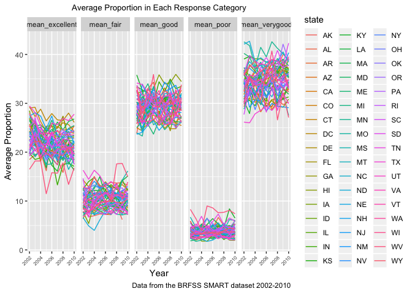

HW3
================
Eric Morris
10/5/2018

Problem 1
---------

Loading in the BRFSS Data:

``` r
library(p8105.datasets)

brfss_data = brfss_smart2010 %>% 
  janitor::clean_names() %>% 
  filter(topic == "Overall Health") %>% 
  select(-class, -topic, -question, -sample_size, -(confidence_limit_low:geo_location)) %>% 
  mutate(response = forcats::fct_relevel(response, c("Excellent", "Very good", "Good", "Fair", "Poor"))) %>% 
  rename(state = locationabbr, county = locationdesc)
```

In 2002, which states were observed at 7 locations?

``` r
brfss_data %>% 
  filter(year == 2002) %>% 
  group_by(state) %>% 
  distinct(county) %>% 
  summarize(n_state = n()) %>% 
  filter(n_state == 7) %>% 
  knitr::kable()
```

| state |  n\_state|
|:------|---------:|
| CT    |         7|
| FL    |         7|
| NC    |         7|

CT, FL and NC were observed at 7 locations.

Make a “spaghetti plot” that shows the number of observations in each state from 2002 to 2010.

``` r
brfss_data %>% 
  distinct(state, county, year) %>% 
  group_by(state, year) %>% 
  summarize(n_locations = n()) %>% 
  ggplot(aes(x = year, y = n_locations, color = state)) + 
  geom_line()
```


Make a table showing, for the years 2002, 2006, and 2010, the mean and standard deviation of the proportion of “Excellent” responses across locations in NY State.

``` r
brfss_data %>% 
  filter(year == 2002 | year == 2006 | year == 2010, state =="NY") %>% 
  spread(key = response, value = data_value) %>% 
  janitor::clean_names() %>% 
  group_by(state, year) %>% 
  summarize(mean_excellent = mean(excellent, na.rm = TRUE),
            sd_excellent = sd(excellent, na.rm = TRUE)) %>% 
  knitr::kable()
```

| state |  year|  mean\_excellent|  sd\_excellent|
|:------|-----:|----------------:|--------------:|
| NY    |  2002|         24.04000|       4.486424|
| NY    |  2006|         22.53333|       4.000833|
| NY    |  2010|         22.70000|       3.567212|

For each year and state, compute the average proportion in each response category (taking the average across locations in a state). Make a five-panel plot that shows, for each response category separately, the distribution of these state-level averages over time.

``` r
brfss_data %>% 
  spread(key = response, value = data_value) %>% 
  janitor::clean_names() %>% 
  group_by(state, year) %>% 
  summarize(mean_excellent = mean(excellent, na.rm = TRUE),
            mean_verygood = mean(very_good, na.rm = TRUE),
            mean_good = mean(good, na.rm = TRUE),
            mean_fair = mean(fair, na.rm = TRUE),
            mean_poor = mean(poor, na.rm = TRUE)) %>% 
  gather(key = mean_variable, value = mean_value, mean_excellent:mean_poor) %>% 
  ggplot(aes(x = year, y = mean_value, color = state)) +
  geom_line() +
  facet_grid(~mean_variable)   
```



Problem 2
---------

Instacart Data Import

``` r
instacart_data = instacart %>% 
  janitor::clean_names()
  
unique_users = instacart_data %>% 
  distinct(user_id) %>% 
  nrow()

distinct_dept = instacart_data %>% 
  distinct(department) %>% 
  nrow()

distinct_products = instacart_data %>% 
  distinct(product_id) %>% 
  nrow()
```

In the instacart dataset there are 15 variables which include identifiers for aisle, order, product and customer along with a corresponding numerical ID in some cases (aisle and product for example). The instacart dataset also includes 1384617 observations which is equivalent to a product from an order. There are 131209 unique users in the dataset that submitted an order, 21 distinct departments that recieved an order, and 39123 distinct products ordered.

``` r
distinct_aisles = 
  instacart_data %>% 
  distinct(aisle_id) %>% 
  nrow()

instacart_data %>% 
  group_by(aisle_id, aisle) %>% 
  summarize(most_aisles = n()) %>% 
  ungroup() %>% 
  top_n(5, most_aisles) %>% 
  arrange(desc(most_aisles)) %>% 
  knitr::kable()
```

|  aisle\_id| aisle                      |  most\_aisles|
|----------:|:---------------------------|-------------:|
|         83| fresh vegetables           |        150609|
|         24| fresh fruits               |        150473|
|        123| packaged vegetables fruits |         78493|
|        120| yogurt                     |         55240|
|         21| packaged cheese            |         41699|

There are 134 distinct aisles in the dataset and the top five aisles with the most items ordered from are:

-   Fresh Vegetables (150,609 items ordered)

-   Fresh Fruits (150,473 items ordered)

-   Packaged Vegetables & Fruits (78,493 items ordered)

-   Yogurt (55,240 items ordered)

-   Packaged Cheese (41,699 items ordered)

Make a plot that shows the number of items ordered in each aisle. Order aisles sensibly, and organize your plot so others can read it.

``` r
instacart_data %>% 
  group_by(aisle_id, aisle) %>% 
  summarize(number_items = n()) %>% 
  arrange(desc(number_items)) %>% 
  ggplot(aes(x = reorder(aisle, -number_items), y = number_items, fill = aisle)) +
  geom_col() +
  theme(axis.text.x = element_text(angle = 50, hjust = 1, size = 8),
        legend.position = "none")
```


-   Make a table showing the most popular item in each of the aisles “baking ingredients”, “dog food care”, and “packaged vegetables fruits”.

``` r
instacart_data %>% 
  filter(aisle == "baking ingredients" | aisle == "dog food care" | aisle == "packaged vegetables fruits") %>% 
  group_by(aisle, product_name) %>% 
  summarize(number_items = n()) %>% 
  top_n(5, number_items) %>% 
  arrange(desc(number_items)) %>% 
  knitr::kable()
```

| aisle                      | product\_name                                   |  number\_items|
|:---------------------------|:------------------------------------------------|--------------:|
| packaged vegetables fruits | Organic Baby Spinach                            |           9784|
| packaged vegetables fruits | Organic Raspberries                             |           5546|
| packaged vegetables fruits | Organic Blueberries                             |           4966|
| packaged vegetables fruits | Seedless Red Grapes                             |           4059|
| packaged vegetables fruits | Organic Grape Tomatoes                          |           3823|
| baking ingredients         | Light Brown Sugar                               |            499|
| baking ingredients         | Pure Baking Soda                                |            387|
| baking ingredients         | Cane Sugar                                      |            336|
| baking ingredients         | Premium Pure Cane Granulated Sugar              |            329|
| baking ingredients         | Organic Vanilla Extract                         |            327|
| dog food care              | Snack Sticks Chicken & Rice Recipe Dog Treats   |             30|
| dog food care              | Organix Chicken & Brown Rice Recipe             |             28|
| dog food care              | Small Dog Biscuits                              |             26|
| dog food care              | Standard Size Pet Waste bags                    |             25|
| dog food care              | Organix Grain Free Chicken & Vegetable Dog Food |             24|

-   Make a table showing the mean hour of the day at which Pink Lady Apples and Coffee Ice Cream are ordered on each day of the week; format this table for human readers (i.e. produce a 2 x 7 table).

Problem 3
---------
